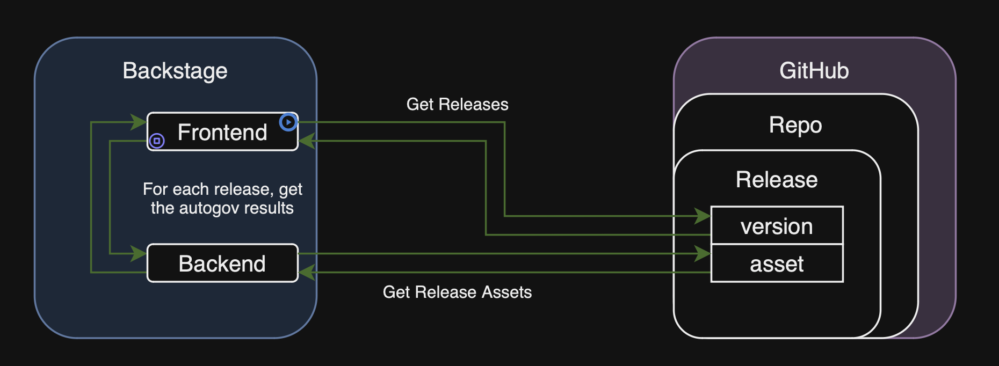
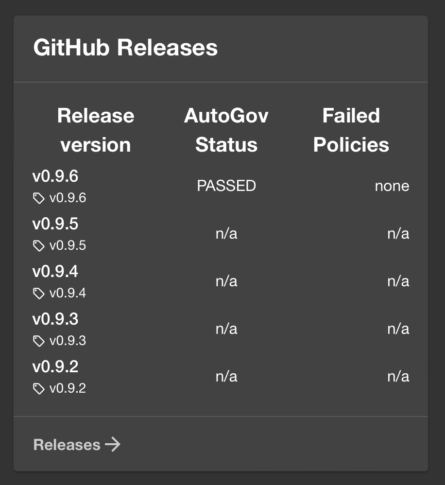
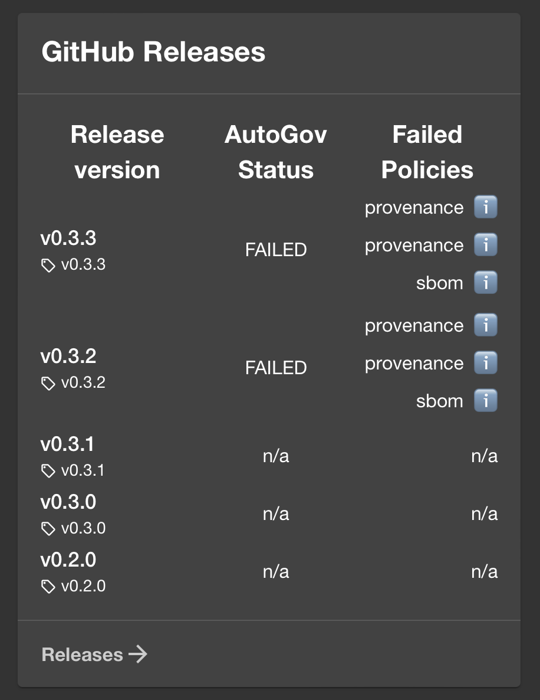

# Backstage GitHub Releases Autogov Plugin

[](https://github.com/liatrio/backstage-plugin-autogov/actions/workflows/codeql.yml) [](https://opensource.org/licenses/Apache-2.0) [](https://github.com/liatrio/backstage-dora-plugin/actions/workflows/release.yml) 

This is a plugin for the [Backstage](https://backstage.io/) Project that provides an extension to the [Roadie Backstage Plugins - GitHub Insights Plugin](https://github.com/RoadieHQ/roadie-backstage-plugins/tree/main/plugins/frontend/backstage-plugin-github-insights) that will display Automated Governance results for the latest releases.

The results displayed are the Automated Governance results published to that releases assets.

## Plugin Architecture

The plugin will include the [Roadie GitHub Code Insights plugin](https://github.com/RoadieHQ/roadie-backstage-plugins/tree/main/plugins/frontend/backstage-plugin-github-insights), but overwrite the Code Insights to use a customized Release Card.

The plugin will overwrite the ReleaseCard definition so the GitHub release assets are displayed for each release.

For each release that the Code Insights plugin fetches, the front end will call the backend of Backstage to fetch the result asset for that release. The frontend will display the contents of the results



## Components

### GitHubReleaseCard

This offers Automated Governance results for each release that was created in compliance with an Automated Governance workflow (which should include publishing the policy results to the release assets).

This will show the results under the GitHub Code Insights tab in the GitHub Releases card.

The frontend will display the contents of the results plugin for the AutoGov status (pass/fail) and if failed, the failed policies are displayed. The failed policies info icon will display the rule message when hovered over.





## Dependencies

This plugin will only display additional release contents if there is a release asset named `results` and that file has `results` and `violations` objects formatted like the following:

```json
{
  "result": "PASSED",
  "violations": []
}
```

or

```json
{
  "result": "FAILED",
  "violations": [
    {
      "policy": "provenance",
      "message": "build type is not correct or missing"
    },
    {
      "policy": "provenance",
      "message": "predicate type is not correct or missing"
    },
    {
      "policy": "sbom",
      "message": "cyclonedx sbom is missing"
    }
  ]
}
```

> If `violations` object has items in the list, each violation item should have `policy` and `message` defined. There can be any number of violations in the list; each will be displayed.

## Installation of Dependencies

### Docker Compose

## Installation into Backstage

> 📓 code insights prompt for GitHub login even with GitHub integration auth token setup

## GitHub

### GitHub Auth

#### ENV

GitHub Code Insights Requires the GitHub Auth Configuration

Backstage GitHub Releases AutoGov Plugin requires dedicated GitHub Token

- enable dotenv by update the script definitions in the root package.json file:

```package.json
"scripts": {
    "dev": "concurrently \"yarn start\" \"yarn start-backend\"",
    "start": "dotenv -e .env yarn workspace app start",
    "start-backend": "dotenv -e .env yarn workspace backend start",
```

- add `GITHUB_TOKEN` to .env

  - [token must](https://docs.github.com/en/rest/releases/assets?apiVersion=2022-11-28#get-a-release-asset--fine-grained-access-tokens):
    - be Fine grain, GitHub App user, or GitHub App installation access token
    - have "Contents" repository permissions (read)

- add dependencies:

```zsh
yarn add concurrently
yarn add dotenv
yarn add dotenv-cli
```

#### GitHub Auth Config

> if your Backstage instance does not have GitHub configured as a provider

- add the GitHub provider
  https://backstage.io/docs/auth/github/provider/

- add sign in
  https://backstage.io/docs/auth/#sign-in-configuration

- add GitHub user you will sign in with
  https://backstage.io/docs/getting-started/config/authentication#adding-a-user

```.yaml
---
apiVersion: backstage.io/v1alpha1
kind: User
metadata:
  name: <my-github-username>
spec:
  memberOf: [guests]
```

- add the following to `packages/app/src/App.tsx`

```.tsx
`import { githubAuthApiRef } from '@backstage/core-plugin-api';`
```

### Add Backstage GitHub Releases AutoGov Plugin

### Add Backend

```zsh
cd packages/backend
yarn add @liatrio/backstage-plugin-github-releases-assets-backend
```

```packages/backend/src/index.ts
backend.add(
  import('@liatrio/backstage-plugin-github-releases-assets-backend'),
);
```

#### Add Frontend

```zsh
cd packages/app
yarn add @liatrio/backstage-plugin-github-releases-autogov
```

```packages/app/src/components/catalog/EntityPage.tsx
import { GithubReleasesAutogovPage } from '@liatrio/backstage-plugin-github-releases-autogov';
...

<EntityLayout.Route
      path="/code-insights"
      title="Code Insights">
      <GithubReleasesAutogovPage />
 </EntityLayout.Route>
```

## Contributing

See [Contributing](./CONTRIBUTING) to Backstage GitHub Releases Autogov Plugin
